# Modelo entidad-relacion

## Entidades base

Todas las tablas transaccionales deben heredar campos auditables:

```text
Id uniqueidentifier primary key
CompanyId uniqueidentifier not null cuando la entidad sea propia de una empresa
CreatedAt datetime2 not null
CreatedByUserId uniqueidentifier null
UpdatedAt datetime2 null
UpdatedByUserId uniqueidentifier null
DeletedAt datetime2 null
DeletedByUserId uniqueidentifier null
IsDeleted bit not null default 0
RowVersion rowversion
```

Los documentos criticos deben agregar:

```text
Status varchar(20) not null -- Draft, Posted, Cancelled
PostedAt datetime2 null
PostedByUserId uniqueidentifier null
CancelledAt datetime2 null
CancelledByUserId uniqueidentifier null
CancellationReason nvarchar(500) null
```

Reglas de estado:

- `Draft` se puede editar y eliminar logicamente.
- `Draft` no genera inventario ni costos.
- `Posted` no se edita ni elimina.
- `Posted` solo se cancela.
- `Cancelled` genera reversas cuando el documento ya afecto inventario o costos.

## Diagrama ER principal

```mermaid
erDiagram
    Company ||--o{ Branch : has
    Company ||--o{ User : employs
    Company ||--|| CompanySettings : configures
    Company ||--o{ Client : owns
    Company ||--o{ Supplier : owns
    Company ||--o{ Project : owns
    Company ||--o{ Warehouse : owns
    Company ||--o{ Material : owns
    Company ||--o{ Machine : owns
    Company ||--o{ CostTransaction : owns
    Company ||--o{ ExchangeRate : defines

    User }o--o{ Role : assigned
    Role }o--o{ Permission : grants
    User ||--o{ UserProjectAccess : scoped_to
    Project ||--o{ UserProjectAccess : grants
    User ||--o{ UserWarehouseAccess : scoped_to
    Warehouse ||--o{ UserWarehouseAccess : grants

    Project ||--o{ Platform : contains
    Platform ||--o{ PlatformActivity : executes
    ActivityCatalog ||--o{ PlatformActivity : defines
    Project ||--o{ DailyWorkReport : reports
    Platform ||--o{ DailyWorkReportLine : advances
    DailyWorkReport ||--o{ WorkIncident : records

    Unit ||--o{ Material : base_unit
    MaterialFamily ||--o{ MaterialSubfamily : contains
    MaterialSubfamily ||--o{ Material : classifies
    Supplier ||--o{ Material : main_supplier
    Material ||--o{ MaterialUnitConversion : converts
    Unit ||--o{ MaterialUnitConversion : from_unit

    Warehouse ||--o{ MaterialReceipt : receives
    MaterialReceipt ||--o{ MaterialReceiptLine : includes
    MaterialReceipt ||--o{ MaterialReceiptTrip : documents
    Truck ||--o{ MaterialReceiptTrip : hauls
    Material ||--o{ MaterialReceiptLine : received_as

    Warehouse ||--o{ MaterialIssue : issues
    Project ||--o{ MaterialIssue : consumes
    Platform ||--o{ MaterialIssue : consumes
    MaterialIssue ||--o{ MaterialIssueLine : includes
    Material ||--o{ MaterialIssueLine : issued_as

    Warehouse ||--o{ InventoryAdjustment : adjusts
    InventoryAdjustment ||--o{ InventoryAdjustmentLine : includes
    Warehouse ||--o{ InventoryTransfer : transfers_from
    InventoryTransfer ||--o{ InventoryTransferLine : includes
    Material ||--o{ InventoryMovement : moved
    Warehouse ||--o{ InventoryMovement : records

    Platform ||--o{ EstimatedMaterialConsumption : budgets
    Material ||--o{ EstimatedMaterialConsumption : estimated

    Machine ||--o{ MachineRateHistory : rates
    Machine ||--o{ DailyMachineLog : logs
    Project ||--o{ DailyMachineLog : uses
    Platform ||--o{ DailyMachineLog : uses

    DieselTank ||--o{ DieselTankMovement : records
    DieselTank ||--o{ DieselLoad : supplies
    Machine ||--o{ DieselLoad : fueled
    Machine ||--o{ DailyMachineDieselConsumption : consumes
    Project ||--o{ DailyMachineDieselConsumption : charged_to
    Platform ||--o{ DailyMachineDieselConsumption : charged_to

    Machine ||--o{ MaintenancePlan : has
    MaintenancePlan ||--o{ MaintenanceTask : defines
    Machine ||--o{ MaintenanceExecution : receives
    MaintenanceTask ||--o{ MaintenanceExecution : completes

    Machine ||--o{ Repair : requires
    Repair ||--o{ RepairPart : uses
    Material ||--o{ RepairPart : part

    LaborCategory ||--o{ LaborRateHistory : rates
    LaborCrew ||--o{ LaborTimeEntry : reports
    Project ||--o{ LaborTimeEntry : charged_to
    Platform ||--o{ LaborTimeEntry : charged_to

    Project ||--o{ PurchaseRequest : requests
    PurchaseRequest ||--o{ PurchaseRequestLine : includes
    PurchaseRequest ||--o{ PurchaseQuotation : quoted_by
    Supplier ||--o{ PurchaseQuotation : submits
    Supplier ||--o{ PurchaseOrder : receives
    PurchaseOrder ||--o{ PurchaseOrderLine : includes
    PurchaseOrder ||--o{ PurchaseReceipt : partially_received_by
    PurchaseReceipt ||--o{ PurchaseReceiptLine : includes

    CostTransaction }o--|| Project : charged_to
    CostTransaction }o--o| Platform : charged_to
    CostTransaction }o--o| PlatformActivity : charged_to
    FileGroup ||--o{ FileGroupItem : groups
    File ||--o{ FileGroupItem : classifies
```



## Relaciones clave

### Multiempresa

- La mayoria de catalogos y documentos pertenecen a una empresa mediante `CompanyId`.
- Las relaciones operativas deben validar que todos los registros pertenecen a la misma empresa.
- Los codigos de proyectos, materiales, maquinas y almacenes son unicos dentro de la empresa, no globalmente.

### Alcance por usuario

- `UserProjectAccess` limita proyectos visibles u operables por usuario.
- `UserWarehouseAccess` limita almacenes visibles u operables por usuario.
- Los permisos definen que puede hacer el usuario; el alcance define donde puede hacerlo.

### Proyecto y plataforma

- Un proyecto tiene muchas plataformas.
- Una plataforma pertenece a un solo proyecto.
- Una plataforma tiene actividades, consumos estimados, consumos reales, reportes diarios y costos.

### Materiales, unidades e inventario

- Un material tiene unidad base.
- Un material puede tener conversiones desde unidades alternas hacia su unidad base.
- Las entradas, salidas, ajustes y transferencias son documentos con lineas.
- Solo al publicar documentos se generan movimientos de inventario.
- El stock actual se calcula por movimientos y puede materializarse en saldos para rendimiento.

### Viajes, remisiones y camiones

- Una entrada de material puede tener uno o varios viajes/remisiones.
- Cada viaje puede registrar camion, placas, operador, numero de remision, peso bruto, tara, peso neto, volumen y evidencia.
- Las lineas de entrada se pueden relacionar con viajes cuando se requiera trazabilidad de acarreo.

### Maquinaria

- Una maquina tiene historial de tarifas por hora en `MachineRateHistory`.
- La bitacora diaria registra horas trabajadas.
- Al publicar bitacoras se generan costos de maquinaria usando la tarifa vigente.
- El consumo de diesel se analiza por maquina y dia.

### Diesel

- `DieselLoad` registra cargas o abastecimientos a maquina, desde proveedor o desde tanque.
- `DailyMachineDieselConsumption` registra el consumo real diario por maquina.
- El costo por plataforma debe calcularse desde `DailyMachineDieselConsumption`, no necesariamente desde `DieselLoad`.
- `DieselTank` y `DieselTankMovement` permiten controlar tanques propios cuando la empresa lo requiera.
- El uso de tanques es opcional: puede existir compra directa a proveedor sin tanque interno.

### Mantenimiento

- Cada tarea de mantenimiento puede tener intervalo por horas, por dias o ambos.
- Las alertas se calculan por horometro actual, fecha ultima ejecucion y umbrales configurados.

### Mano de obra

- La mano de obra basica registra cuadrillas, categorias, tarifas y horas por proyecto/plataforma.
- No incluye nomina completa, incidencias laborales, impuestos ni dispersion de pagos.
- Al publicarse genera costos de tipo `Labor`.

### Costos

El costo real de plataforma se compone desde `CostTransactions`:

- Material real consumido.
- Diesel consumido diariamente e imputado a plataforma.
- Horas de maquinaria valorizadas.
- Mano de obra basica.
- Mantenimientos o reparaciones imputables.
- Ajustes u otros costos autorizados.

Las transacciones de costo deben conservar moneda:

- `Currency`.
- `ExchangeRate`.
- `Amount`.
- `AmountBaseCurrency`.

### Productividad

Las metricas de productividad se calculan desde avance, maquinaria, diesel, mano de obra y costos:

- m3 por hora maquina.
- Litros por m3.
- Costo por m3.
- Costo por m2.
- Horas hombre por plataforma.

### Incidencias de obra

`WorkIncidents` registra eventos que afectan avance, costo o productividad:

- Lluvia.
- Falta de material.
- Maquina descompuesta.
- Espera de proveedor.
- Paro de personal.
- Retrabajo.

### Archivos y evidencias

Los archivos deben clasificarse con `FilePurpose` para facilitar auditoria y consulta:

- Remision.
- Factura.
- Foto de material.
- Foto de maquina.
- Evidencia de reparacion.
- Comprobante de diesel.
- Documento legal.

## Agregados sugeridos

- Company como raiz administrativa.
- CompanySettings como configuracion operativa de la empresa.
- Project como agregado raiz de obra.
- Platform como agregado operativo principal.
- Material como catalogo raiz con conversiones.
- InventoryDocument para entradas, salidas, ajustes y transferencias.
- Machine como agregado raiz de maquinaria con tarifas.
- DieselTank como agregado opcional de combustible.
- MaintenancePlan como agregado de planeacion.
- PurchaseOrder y PurchaseReceipt como agregados de compras.
- CostTransaction como ledger append-only.
- WorkIncident como parte del reporte diario.

## Eventos de dominio sugeridos

- MaterialReceiptPosted.
- MaterialIssuePosted.
- InventoryAdjustmentPosted.
- InventoryTransferPosted.
- CostTransactionCreated.
- PlatformCostChanged.
- MaterialDeviationExceeded.
- DieselAnomalyDetected.
- MachineHoursLogged.
- MachineRateChanged.
- MaintenanceDueDetected.
- RepairRegistered.
- DailyWorkReportPosted.
- WorkIncidentRegistered.
- LaborTimeEntryPosted.
- PurchaseReceiptPosted.
- InventoryMinimumReached.
