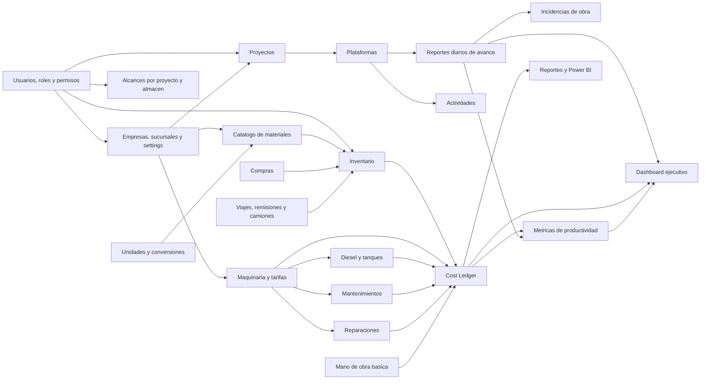
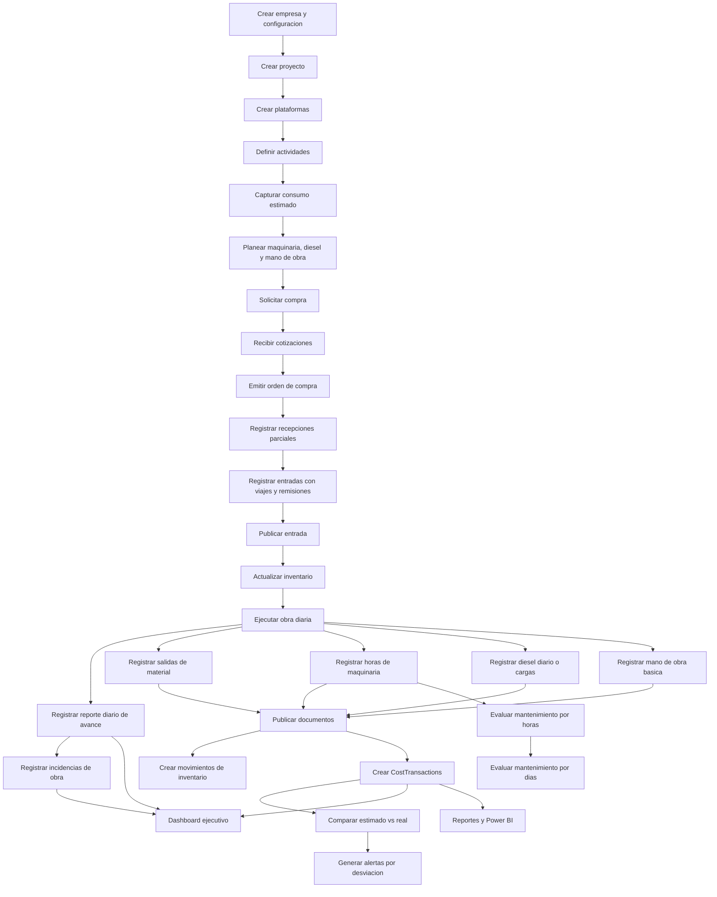

# Diagrama de modulos y flujo de negocio

## Modulos

## Flujo completo del negocio

## Reglas de documentos

1. `Draft` se puede editar.
2. `Draft` se puede eliminar logicamente.
3. `Draft` no genera inventario ni costos.
4. `Posted` no se edita ni elimina.
5. `Posted` solo se cancela.
6. `Cancelled` genera reversas si ya afecto inventario o costos.

## Flujo de multiempresa y alcance

1. El usuario inicia sesion y se determina su `CompanyId`.
2. La API carga permisos y configuracion de empresa.
3. Cuando existan proyectos y almacenes, la API tambien carga alcances operativos.
4. Toda consulta operativa filtra por `CompanyId`.
5. Toda accion valida permiso y, cuando aplique, alcance.
6. Ningun documento puede mezclar proyectos, almacenes, materiales o maquinas de distintas empresas.

## Flujo de material

1. Compras genera solicitud.
2. Se registran cotizaciones por proveedor.
3. Se emite orden de compra.
4. Almacen registra recepcion parcial contra orden cuando aplique.
5. Se captura entrada de material con factura, remision, viajes y camiones.
6. La entrada permanece en `Draft` hasta validacion.
7. Al publicar, el sistema genera movimientos de inventario y actualiza saldos.
8. Una salida asigna material a proyecto, plataforma y actividad.
9. Al publicar salida, se descuenta inventario y se crean `CostTransactions` de material.
10. El consumo real se compara contra el consumo estimado.
11. Si la desviacion supera `CompanySettings.MaterialDeviationAlertPercent`, se genera alerta.

## Flujo de ajustes y transferencias

1. Almacen crea ajuste o transferencia en `Draft`.
2. Agrega lineas con material, unidad y cantidad.
3. El sistema convierte cantidades a unidad base.
4. Al publicar ajuste, crea movimientos de entrada o salida.
5. Al publicar transferencia, crea salida del almacen origen y entrada al almacen destino.
6. Si el documento publicado se cancela, el sistema crea movimientos reversos y costos reversos si aplica.

## Flujo de maquinaria

1. Se registra maquina con horometro actual.
2. Se registra historial de tarifa por hora.
3. Se asigna operador y ubicacion.
4. Diario se registra horometro inicial y final.
5. El sistema calcula horas trabajadas.
6. Al publicar la bitacora, calcula costo con la tarifa vigente.
7. Las horas y costo se imputan a proyecto, plataforma y actividad.
8. El sistema evalua mantenimientos por horas y por dias.

## Flujo de diesel

1. Se registra carga de diesel por maquina desde proveedor o tanque interno.
2. Si usa tanque, el sistema crea movimiento de tanque.
3. Se captura o consolida consumo diario por maquina.
4. Se asigna consumo a proyecto y plataforma cuando aplique.
5. El sistema calcula litros por hora y costo por hora.
6. Se compara contra consumo esperado y `CompanySettings.DieselAnomalyPercent`.
7. Si excede umbral configurable, se marca anomalia.
8. Al publicar consumo diario, el costo se registra en `CostTransactions`.

Nota: `DieselLoad` representa carga o abastecimiento; `DailyMachineDieselConsumption` representa consumo real diario. El costo por plataforma sale del consumo real diario, no necesariamente de la carga.

## Flujo de mantenimiento

1. Se define plan de mantenimiento por maquina.
2. Cada tarea puede tener intervalo por horas, por dias o ambos.
3. El sistema compara horometro actual y fecha de ultima ejecucion.
4. Genera alertas por horas restantes, dias restantes o vencimiento.
5. Al publicar ejecucion, registra costo si aplica y reinicia el conteo de la tarea.

## Flujo de avance y mano de obra

1. El residente captura reporte diario de obra.
2. Registra avance por plataforma y actividad.
3. Registra incidencias: lluvia, falta de material, maquina descompuesta, espera de proveedor, paro de personal o retrabajo.
4. Captura cuadrillas, categorias, horas y cantidad de personal.
5. Al publicar mano de obra, el sistema genera `CostTransactions` de tipo `Labor`.
6. El dashboard muestra avance diario y acumulado.

## Flujo de costos

El costo real de la plataforma se lee desde `CostTransactions`:

- Materiales reales consumidos.
- Diesel consumido diariamente e imputado a plataforma.
- Horas de maquinaria por tarifa vigente.
- Mano de obra basica.
- Mantenimientos o reparaciones asignables.
- Ajustes autorizados.

La plataforma puede mantener `RealCost` como valor materializado para rendimiento, pero la fuente de verdad es el ledger.

## Flujo de productividad

Las metricas se calculan desde avance, horas maquina, diesel, costos y mano de obra:

- m3 por hora maquina.
- Litros por m3.
- Costo por m3.
- Costo por m2.
- Horas hombre por plataforma.

## Dashboard ejecutivo

Indicadores prioritarios:

- Costo por plataforma.
- Costo por proyecto.
- Estimado vs real.
- Material estimado vs real.
- Consumo diario de diesel.
- Litros por hora por maquina.
- m3 por hora maquina.
- Litros por m3.
- Costo por m3.
- Costo por m2.
- Horas hombre por plataforma.
- Costo de maquinaria.
- Costo de mano de obra.
- Inventario actual por almacen.
- Material mas utilizado.
- Maquinas detenidas.
- Proximos mantenimientos por horas y dias.
- Reparaciones.
- Avance fisico diario y acumulado.
- Incidencias de obra.
