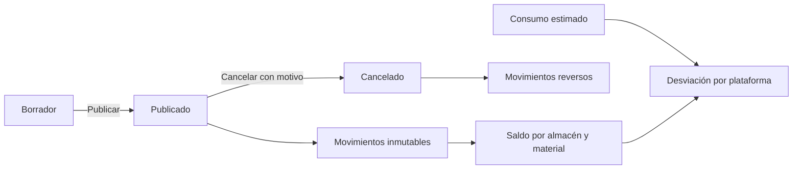

# Documento maestro del proyecto

## ERP Trojes de Marañón

| Campo | Valor |
|---|---|
| Código | TDM-ERP |
| Versión | 1.0 — Base para validación |
| Estado | Borrador controlado |
| Línea base revisada | 9 de julio de 2026 |

## 1. Propósito y jerarquía

Referencia única para gobernar alcance, requisitos, reglas, pruebas y aceptación. Orden de precedencia: cambio aprobado; acta/documento maestro; alcance y reglas; requerimientos consolidados; matriz; arquitectura/casos de uso/APIs/roadmap; README. El software existente demuestra una capacidad técnica, no su aceptación comercial.

## 2. Definición del producto

ERP web multiempresa para empresas de construcción, centrado inicialmente en proyectos, plataformas, materiales y almacenes. El núcleo transaccional usa documentos publicables que generan movimientos de inventario y permiten rastrear consumo real frente a estimado.

## 3. Estado consolidado

La implementación supera la declaración “MVP 2” del README: existen entidades, endpoints y páginas para proyectos, plataformas, recepciones, salidas, transferencias, ajustes, saldos, movimientos y desviaciones. Maquinaria, diésel, mantenimiento, mano de obra, compras avanzadas, costos y reportes ejecutivos permanecen como visión por fases.

## 4. Paquete documental

- `acta-constitutiva.md` — mandato, interesados, riesgos y aprobación.
- `alcance-producto.md` — entregado frente a planificado/excluido.
- `requerimientos-consolidados.md` — obligaciones verificables.
- `reglas-de-negocio.md` — invariantes de documentos, unidades e inventario.
- `matriz-trazabilidad.md` — evidencia y pruebas.
- `01` a `08` — diseño técnico y roadmap detallado existente.

## 5. Arquitectura de control

La SPA consume `/api/v1`; la API .NET aplica autorización y reglas; EF Core persiste en Supabase/PostgreSQL. `CompanyId`, permisos y alcance se derivan del usuario autenticado. La base local de Docker es solo alternativa de desarrollo.

## 6. Entregables por control de fase

Cada MVP debe definir alcance, migración, endpoints, interfaz, permisos, auditoría, pruebas, manual, despliegue y aceptación. Una fase no se considera entregada solo por existir en el ERD o roadmap.

## 7. Estrategia de pruebas

- Unidad: conversiones, estados, numeración y cálculos.
- Integración: filtros de empresa, permisos, publicación, reverso e idempotencia.
- Concurrencia: dos salidas contra el mismo saldo y doble publicación.
- E2E: borrador-publicación-consulta-cancelación desde UI.
- Reconciliación: saldo almacenado frente a suma de movimientos.
- Seguridad: acceso cruzado por empresa, proyecto y almacén.

## 8. Decisiones pendientes

1. Patrocinador, propietario y responsables por módulo.
2. Nombre legal de empresa(s), series documentales y monedas iniciales.
3. Política de stock negativo, cierres y reaperturas.
4. Reglas de aprobación para ajustes, compras y costos.
5. Definiciones de avance, productividad y costo atribuible.
6. SLA, carga esperada, RTO, RPO, retención y soporte.
7. Orden y presupuesto de las fases futuras.

## 9. Control de cambios y aprobación

Todo cambio registra solicitante, motivo, requerimientos/reglas afectados, impacto en datos, seguridad, UI, pruebas, despliegue y fecha. La versión solo se aprueba con resolución de decisiones críticas y firma o aprobación electrónica trazable en el acta.
